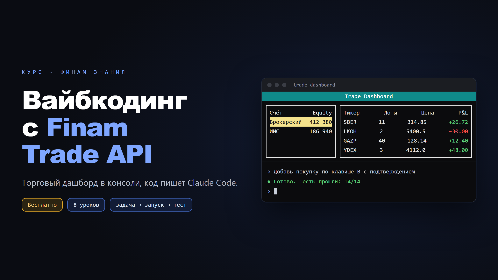

Записал бесплатный курс из 8 уроков на Финам Знания. За курс собираем свой торговый дашборд в консоли: все счета и позиции на одном экране, цены в реальном времени, покупка и продажа с клавиатуры.

Код пишет Claude Code. Вы ставите задачи и проверяете результат, поэтому курс подойдёт и тем, кто никогда не программировал.

Самое важное в курсе не код, а то, как вести агента: короткая задача → запуск → тест. Мы составляем требования, описываем, как должна работать программа, отвечаем на вопросы агента и смотрим на результат.

Курс хорошо подойдёт тем, кому интересна торговля ценными бумагами.

Код со спецификациями и промптами лежит на [GitHub](https://github.com/updevru/finam-trade-api-course).

[Пройти курс на Финам Знания](https://education.finam.ru/course/vaibkodim-s-finam-trade-api/)
