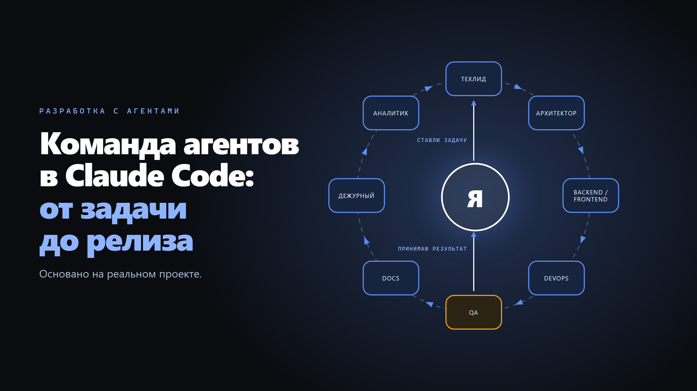

Опубликовал на Хабре, как полгода в одиночку делаю сервис руками агентов Claude Code: двенадцать ролей, обязательный порядок этапов и максимальная автономия агентов от постановки задачи до выпуска релиза. Рассказываю, кто чем занимается, как задача проходит путь от строки в бэклоге до релиза и с чего начать, если хочется так же у себя.

[Читать на Хабр](https://habr.com/ru/articles/1086832/)
