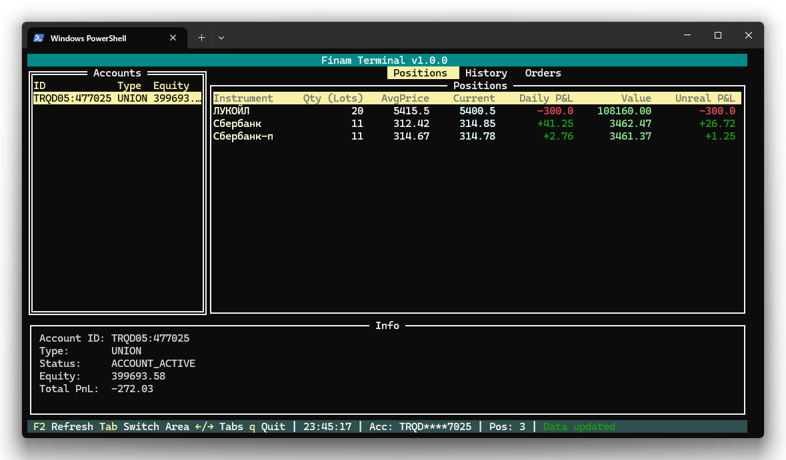

Написал свою первую статью на Хабре — про Finam Terminal, TUI-клиент для торговли прямо в консоли. Рассказал, зачем он вообще появился, как устроен изнутри и каково это — строить что-то поверх публичного API брокера.

[Читать на Хабр](https://habr.com/ru/companies/finam_broker/articles/1020970/)
