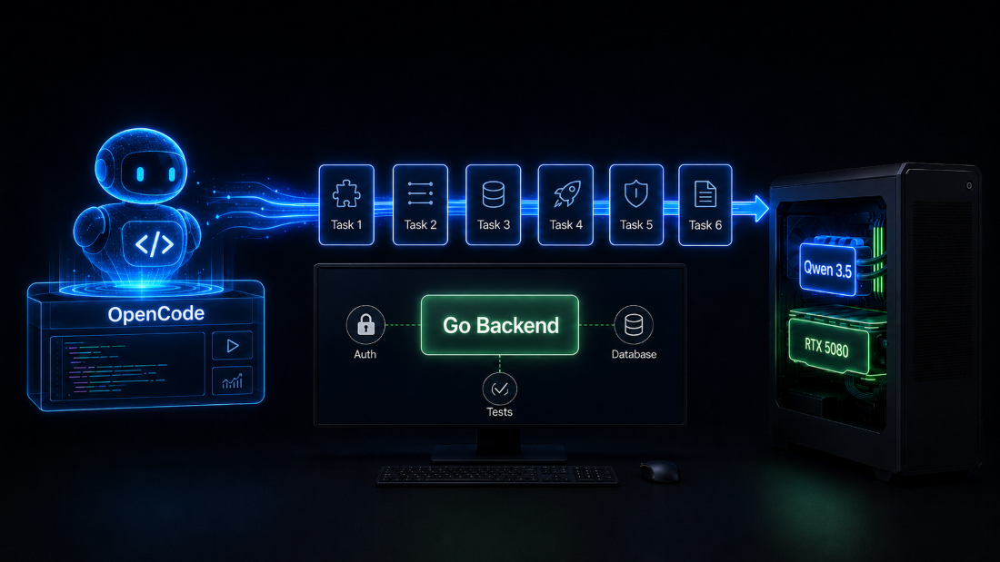

Опубликовал на Хабре эксперимент с локальной Qwen: взял небольшую backend-задачу на Go с регистрацией, JWT, PostgreSQL, Docker Compose и тестами, а затем проверил, насколько локальная модель справится с реализацией через агента.

[Читать на Хабр](https://habr.com/ru/articles/1043090/)
