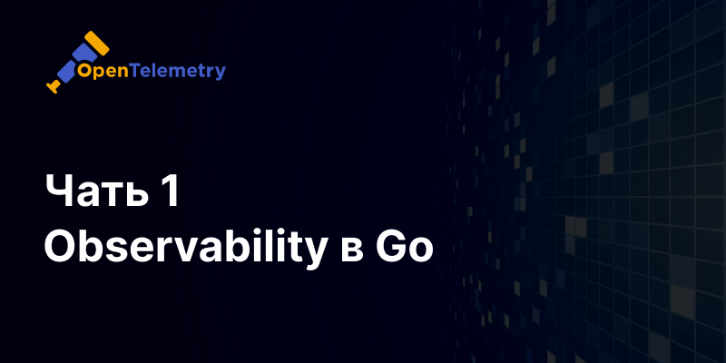

В современном мире микро-сервисной архитектуры и распределённых систем понятие наблюдаемости (observability) 
стало ключевым фактором успешной эксплуатации и поддержания работоспособности приложений. 
Наблюдаемость позволяет вам получить глубокое понимание состояния ваших систем через метрики, логи и трассировки.

## Теория

Что такое наблюдаемость? Наблюдаемость — это способность системы обеспечивать прозрачность своего внутреннего состояния на основе внешних данных, 
таких как логи, метрики и трассировки.

Основные составляющие наблюдаемости:

1) Метрики: Количественные данные, измеряющие производительность системы (например, количество запросов в секунду, использование памяти).
2) Логи: Записи событий, происходящих в системе (например, ошибки, информационные сообщения).
3) Трассировки: Данные о пути выполнения запросов через различные компоненты системы.

**OpenTelemetry: Единое решение для observability**

[OpenTelemetry](https://opentelemetry.io/) — это проект с открытым исходным кодом, который предоставляет инструменты 
и стандарты для сбора, обработки и экспорта телеметрических данных (метрик, логов и трассировок) из приложений.

Единый SDK: для сбора метрик, логов и трассировок.
Поддержка множества языков: включая Java, JavaScript, Python, Go, и другие.
Совместимость с различными бэкендами: такими как Prometheus, Jaeger, ClickHouse и другие.
Расширяемость и гибкость: можно настроить и расширить под свои нужды.

**Интеграция с другими системами**

OpenTelemetry интегрируется с множеством систем мониторинга и логирования, что позволяет использовать данные 
с различных источников для получения полного представления о состоянии системы.

- Prometheus и Grafana Mimir: для сбора метрик
- Jaeger и Grafana Tempo: для распределённых трассировок
- ElasticSearch, Grafana Loki или Splunk: для логирования

**Взаимодействия разных систем**

Когда в ваши сервисы интегрированы OpenTelemetry, то вы сможете увидеть все взаимодействия между этими 
системами - совершаемые операции, обращения по REST или gRCP, запросы в БД и т.д. 
Одним словом - наблюдаемость ваших систем сильно повышается, и это очень сильно помогает разбираться с проблемами и инцидентами.

## Настройка в Go приложении

Рассмотрим пример настройки OpenTelemetry для Go-приложения.
Логи, метрики и трейсы будем отправлять в OpenTelemetry collector.

**1) Настройка провайдеров и экспортеров**

```go
package telemetry

import (
    "context"
    "go.opentelemetry.io/otel"
    "go.opentelemetry.io/otel/log/global"
)

func SetupOTel(ctx context.Context) (err error) {
    prop := newPropagator()
    otel.SetTextMapPropagator(prop)

    // Set up trace provider.
    tracerProvider, _ := newTraceProvider(ctx)
    otel.SetTracerProvider(tracerProvider)

    // Set up meter provider.
    meterProvider, _ := newMeterProvider(ctx)
    otel.SetMeterProvider(meterProvider)

    // Set up logger provider.
    loggerProvider, _ := newLoggerProvider(ctx)
    global.SetLoggerProvider(loggerProvider)

    return nil
}
```

Упрощенный вариант, полный пример [тут](https://github.com/updevru/go-micro-kit/blob/main/telemetry/otel.go).

**2) Настройка логгера**

Реализуем отправку логов в output и параллельно в collector.

```go
package telemetry

import (
    slogmulti "github.com/samber/slog-multi"
    "go.opentelemetry.io/contrib/bridges/otelslog"
    "go.opentelemetry.io/otel/log/global"
    "log/slog"
    "os"
)

func CreateLogger() *slog.Logger {
    return slog.New(
        slogmulti.Fanout(
            slog.NewJSONHandler(os.Stdout, nil),
            otelslog.NewHandler("main", otelslog.WithLoggerProvider(global.GetLoggerProvider())),
        ),
    )
}
```

**3) Настройка отправки трейсов**

Реализуем отправку трейсов в collector.

```go
package telemetry

import (
    "go.opentelemetry.io/otel"
    "go.opentelemetry.io/otel/trace"
)

func CreateTracer() trace.Tracer {
    return otel.Tracer("main")
}
```

**4) Настройка отправки метрик**

Реализуем отправку метрики в collector.

```go
package telemetry

import (
    "go.opentelemetry.io/otel"
    "go.opentelemetry.io/otel/metric"
)

func CreateMeter() metric.Meter {
    return otel.Meter("main")
}
```

**Пример использования**

Сделаем самый простой пример использования, чтобы показать как работать со всеми тремя составляющими.

```go
package main

import (
    "context"
    "github.com/updevru/go-micro-kit/telemetry"
    "log/slog"
    "os"
    "os/signal"
    "syscall"
    "time"
)

func main() {
    ctx, stop := signal.NotifyContext(context.Background(), os.Interrupt, syscall.SIGTERM)
    defer stop()

    // Set up OpenTelemetry.
    telemetry.SetupOTel(ctx)

    logger := telemetry.CreateLogger()
    tracer := telemetry.CreateTracer()
    meter := telemetry.CreateMeter()

    logger.InfoContext(ctx, "Log message", slog.String("key", "value"))

    start := time.Now()
    histogram, _ := meter.Float64Histogram("operation.duration")
    ctxSpan, span := tracer.Start(ctx, "operation.Name")
    if err := OperationName(ctxSpan); err != nil {
        span.RecordError(err)
        logger.ErrorContext(ctxSpan, "Error message", slog.String("error", err.String()))
    }
    span.End()
    histogram.Record(ctxSpan, time.Since(start).Seconds())
}
```

С одной стороны получается достаточно громоздкая конструкция, но на самом деле существуют плагины и middleware 
для разных библиотек которые подобное делают автоматически - для http/gRPC клиентов и серверов, 
для библиотек к базам данных и т.д.

## Подключение плагинов и библиотек

Для разных библиотек существуют плагины и расширения для автоматического инструментирования.
Ниже приведу пример лишь некоторых наиболее распространенных и которые сам использовал.

**GORM**

Плагин автоматически оборачивает в трейс каждый запрос к БД и после этого в трейсах виден сам SQL запрос, 
сколько он длился и какие были параметры.

```go
package database

import (
    "github.com/uptrace/opentelemetry-go-extra/otelgorm"
    driver "gorm.io/driver/postgres"
    "gorm.io/gorm"
    "gorm.io/gorm/logger"
)

func Connect(dsn string) (*gorm.DB, error) {
    cfg := &gorm.Config{
        Logger:      logger.Default.LogMode(logger.Silent),
        QueryFields: false,
    }

    db, err := gorm.Open(driver.Open(dsn), cfg)
    if err == nil {
        err = db.Use(otelgorm.NewPlugin())
    }

    return db, err
}
```

**gRPC**

Плагин автоматически создает по трейсу на каждый запрос.
Соответственно через контекст трейсы связываются и внутри gRPC запроса будут видны все запросы БД.

```go
package server

import (
    "go.opentelemetry.io/contrib/instrumentation/google.golang.org/grpc/otelgrpc"
    "google.golang.org/grpc"
)

srv := grpc.NewServer(
    grpc.StatsHandler(otelgrpc.NewServerHandler()),
)
```

**HTTP Client**

Автоматически оборачивает в трейсы все вызовы и фиксирует в нем сам запрос, статус ответа и время выполнения.

```go
import (
    http2 "github.com/go-kit/kit/transport/http"
    "go.opentelemetry.io/contrib/instrumentation/net/http/otelhttp"
    "net/http"
)

func NewHttpClient() http2.HTTPClient {
    return &http.Client{Transport: otelhttp.NewTransport(http.DefaultTransport)}
}
```

_В статье куски кода упрощены для лучшего понимания сути, 
полную версию работающего кода можно [найти в репозитории](https://github.com/updevru/go-micro-kit)_.