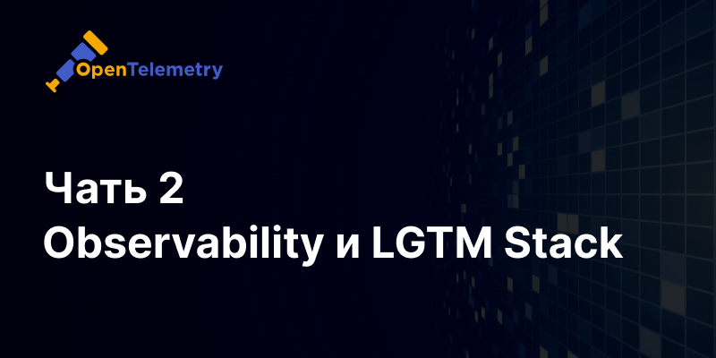

[В первой части](../observability-go) мы научились отправлять данные из Go приложения в формате OpenTelemetry, теперь необходимо их сохранять 
для визуализации и анализа. Для этого есть множество готовых инструментов, рассмотрим LGTM Stack.

LGTM — это популярный стек для мониторинга и наблюдаемости, включающий в себя Loki, Grafana, Tempo и Mimir. 
Этот набор инструментов обеспечивает полный цикл сбора и визуализации метрик, логов и трассировок.

## Что такое LGTM Stack?

**Loki** — система для агрегирования и анализа логов.

**Grafana** — платформа для визуализации метрик, логов и трассировок.

**Tempo** — система для распределенного трейсинга.

**Mimir** — система для долговременного хранения метрик.

Сразу можно посмотреть на готовый [docker-compose.yaml](https://github.com/updevru/go-micro-kit-example/blob/master/docker-compose.yaml) 
и конфигурацию каждого из [компонентов](https://github.com/updevru/go-micro-kit-example/tree/master/deployments). 

_Помечу, это готовый пример для использования на этапе разработки, не для production._

## Как это работает?

Приложение отправляет данные OpenTelemetry (логи, метрики и трассировки) в OpenTelemetry collector на единый адрес.
Коллектор раскладывает эти данные по разным системам.


Пример конфигурации коллектора:

```
receivers:
  otlp:
    protocols:
      grpc:
        endpoint: 0.0.0.0:4317
      http:
        endpoint: 0.0.0.0:4318
exporters:
  otlp:
    endpoint: tempo:4317
    tls:
      insecure: true
  prometheusremotewrite:
    endpoint: http://mimir:9009/api/v1/push
    tls:
      insecure: true
  otlphttp:
    endpoint: http://loki:3100/otlp
service:
  pipelines:
    traces:
      receivers: [otlp]
      exporters: [otlp]
    metrics:
      receivers: [otlp]
      exporters: [ prometheusremotewrite ]
    logs:
      receivers: [ otlp ]
      exporters: [ otlphttp ]
```

Как правило, коллектор устанавливается рядом с приложением на сервере, если серверов несколько то на каждом сервере.

Коллектор полезен тем, что это единый endpoint на который можно отправлять все данные, плюс он умеет их сжимать/модифицировать и эффективно передавать дальше.

## Запуск

Наиболее удобный способ запуска docker compose, ниже кратки пример файла.
Полной готовый файл [тут](https://github.com/updevru/go-micro-kit-example/blob/master/docker-compose.yaml).

```yaml
version: '3.7'

services:
  app:
    image: golang:1.21
    ports:
      - "8180:8180"
      - "8280:8280/tcp"
    environment:
      - "OTEL_EXPORTER_OTLP_ENDPOINT=http://otel-collector:4318"
    volumes:
      - ./:/app/
    working_dir: /app
    command: go run main.go

  tempo:
    image: grafana/tempo:latest
    command: [ "-config.file=/etc/tempo.yaml" ]
    volumes:
      - ./deployments/tempo/tempo.yaml:/etc/tempo.yaml

  otel-collector:
    image: otel/opentelemetry-collector-contrib
    volumes:
      - ./deployments/otelcol/config.yaml:/etc/otelcol-contrib/config.yaml

  mimir:
    image: grafana/mimir:latest
    volumes:
      - ./deployments/mimir/mimir.yaml:/etc/mimir/mimir.yaml
    command: "--config.file=/etc/mimir/mimir.yaml"

  grafana:
    image: grafana/grafana:latest
    ports:
      - "3000:3000"

  loki:
    image: grafana/loki:3.1.0
    volumes:
      - ./deployments/loki/config.yaml:/mnt/config/loki.yml
    command: --config.file=/mnt/config/loki.yml
```

Сервис app - это пример приложения который отправляет данные в формате OpenTelemetry.

Стартуем:

```
docker compose up -d
```

## Настройки визуализации

После установки всех компонентов, вы можете использовать Grafana для визуализации ваших метрик, логов и трассировок. 
Добавьте соответствующие источники данных в Grafana и создайте дашборды для мониторинга ваших сервисов.
