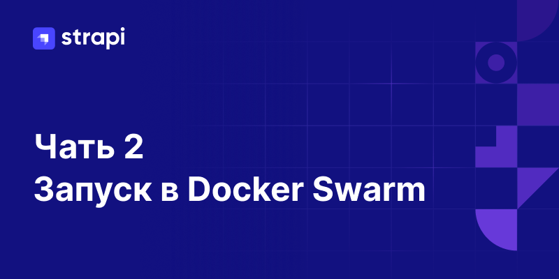

После того как мы создали первую версию нашего приложения, создали Dockerfile, проверили работоспособность приложения в контейнере,
встает вопрос как это выложить на prod, и самое главное как его обновлять далее.

Можно пойти в Kubernetes, но если у вас не большое количество сервисов и нет отдельного отдела для обслуживания Kubernetes,
то следуют выбрать что-то попроще.

Экосистема Docker предлагает нам воспользоваться режимом [swarm mode](https://docs.docker.com/engine/swarm/).
В этом режиме, можно объединять несколько серверов в один кластер и запускать в нем приложения точно так же, как на одном сервере.

Удобные особенности swarm mode, которые облегчают поддержку и обновление сервисов запускаемых через docker:

- deploy без downtime из коробки (правильные порядок запуска и старт новой версии с последующей остановкой старой)
- объединение нескольких серверов в кластер
- overlay сеть поверх всех хостов
- автоматическое распределение сервисов по серверам

[](https://mermaid.live/edit#pako:eNpVj7EKwkAMhl_lyFwntyKCWJwUlKuLPYfQS-th2yu5FJHSd_e0Opgp_N8HyT9C6S1BClXjH-UNWVSemU7F2RQ5I1XuflWrxWKtdKGFsXfXGes5zYqjD1IzBX3a_6NdoZcqiGes6Uu24zkQTzPfQAItcYvOxgfGt2FAbtSSgTSuliocGjFguimqOIjXz66EVHigBIbeolDmsGZsfyFZFw8e5k6fagn02F28j0qFTaDpBdzpTZ0)

## Установка Docker

Для начала необходимо установить [Docker](https://docs.docker.com/engine/install/)
и [Docker compose](https://docs.docker.com/compose/install/linux/) на сервер.

## Переключение в swarm mode

```
docker swarm init
```

В консоли отобразиться команда для добавления в кластер других серверов.

Рекомендую на будущее создать overlay сети, чтобы в позже можно было легко подключать дополнительные сервера.

```
docker network create --driver overlay --attachable cluster-network
```

## Proxy сервис

Если нам на одном сервере необходимо использовать больше одного приложения, которые слушают 80 или 443 порты,
то необходимо использовать прокси nginx, Traefik, Envoy или другой. Такой прокси сервис принимает http запросы и на основании url распределяют запросы по сервисам.

В качестве gateway рекомендую использовать [Traefik](https://traefik.io).

Он удобен:

- автоматически считывает конфигурацию из labels контейнеров
- умеет проксировать трафик до наших сервисов и распределять нагрузку
- самостоятельно создает и обновляет сертификат через letsencrypt.org

Для этой роли можем использовать и nginx, но количество ручной работы будет сильно больше.

Для публикации сервиса достаточно прописать labels, например так:

```
services:
  strapi:
    deploy:
      labels:
        - traefik.http.routers.strapi.rule=Host(`strapi.project.ru`)
        - traefik.http.services.strapi.loadbalancer.server.port=1337
        - traefik.http.routers.strapi.entrypoints=websecure
        - traefik.http.routers.strapi.tls.certresolver=default
```

Этот сервис будет принимать весь трафик с доменом strapi.project.ru по https, так же автоматически будет создан сертификат.

## Подготовка docker-compose.yaml

Что и как запускать описывается в уже знакомом формате docker-compose.yaml.

```
services:
  proxy:
    image: traefik:v2.9
    ports:
      - "80:80"
      - "443:443"
    networks:
      - global
    volumes:
      - /var/run/docker.sock:/var/run/docker.sock
      - proxy-acme:/acme
    command:
      - "--api.insecure=true"
      - "--providers.docker=true"
      - "--providers.docker.swarmMode=true"
      - "--providers.docker.exposedbydefault=false"
      - "--entrypoints.web.address=:80"
      - "--entrypoints.websecure.address=:443"
      - "--certificatesresolvers.default.acme.httpchallenge=true"
      - "--certificatesresolvers.default.acme.httpchallenge.entrypoint=web"
      - "--certificatesresolvers.default.acme.email=notify@email.ru"
      - "--certificatesresolvers.default.acme.storage=/acme/acme.json"
    deploy:
      mode: replicated
      replicas: 1
      update_config:
        parallelism: 2
        delay: 15s
        order: start-first

  postgres:
    image: postgres:16.2
    volumes:
      - postgres-data:/var/lib/postgresql/data
    networks:
      - global
    environment:
      TZ: "Europe/Moscow"
      POSTGRES_DB: strapi
      POSTGRES_USER: strapi
      POSTGRES_PASSWORD: strapi
    deploy:
      mode: replicated
      replicas: 1
      update_config:
        parallelism: 1
        order: stop-first

  strapi:
    image: updev/strapi
    networks:
      - global
    environment:
      APP_URL: "https://strapi.project.ru"
      APP_KEYS: 33h8bQmgX7sRpIFzEAYSiA==,jn0G/M0akKqWgq73iC+n4w==,o7ZmUZONopLPZiwuoRJ9XA==,hU+7Ra9xwrN+7ZtWXeO+7g==
      API_TOKEN_SALT: K/QGU......3Gw==
      ADMIN_JWT_SECRET: 1PI.....Gvw==
      TRANSFER_TOKEN_SALT: ni......hA==
      DATABASE_CLIENT: postgres
      DATABASE_HOST: postgres
      DATABASE_PORT: 5432
      DATABASE_NAME: strapi
      DATABASE_USERNAME: strapi
      DATABASE_PASSWORD: strapi
      YC_BUCKET: strapi-data
      YC_ACCESS_KEY_ID: YC....Yk
      YC_ACCESS_SECRET: YCO....LyaE
      JWT_SECRET: 0wd.....tGKg==
    depends_on:
      - postgres
    deploy:
      labels:
        - traefik.enable=true
        - traefik.docker.network=cluster-network
        - traefik.http.routers.strapi.rule=Host(`strapi.project.ru`)
        - traefik.http.services.strapi.loadbalancer.server.port=1337
        - traefik.http.routers.strapi.entrypoints=websecure
        - traefik.http.routers.strapi.tls.certresolver=default
      mode: replicated
      replicas: 1
      update_config:
        parallelism: 2
        delay: 60s
        order: start-first
        failure_action: rollback
      restart_policy:
        condition: on-failure
        delay: 15s

volumes:
  postgres-data:
  proxy-acme:

networks:
  global:
    external: true
    name: cluster-network
```

В нем описаны:
- Прокси сервис - Traefik
- База данных PostgresSQL
- Strapi

Вместо `notify@email.ru`, `strapi.project.ru` укажите свои данные.
У сервиса strapi укажите свои секреты и ключи в секции environment.


## Запуск сервиса

Для запуска всех сервисов достаточно выполнить команду:

```
docker stack deploy --compose-file ./docker-swarm/docker-compose.yaml strapi
```

Эта команда запустит все сервисы, описанные в файле.

## Обновление сервиса

Для обновления какого либо сервиса достаточно выполнить такую же команду, как и при запуске.

Сервисы обновятся только те, у которых:
- изменилась конфигурация в docker-compose.yaml
- есть более новая версия образа

За логику обновления отвечает секция `update_config` в docker-compose.yaml, документация по этой секции [тут](https://docs.docker.com/compose/compose-file/deploy/).

Разберем на примере:

```
deploy:
  mode: replicated
  replicas: 1
  update_config:
    parallelism: 2
    delay: 15s
    order: start-first
    failure_action: rollback
  restart_policy:
    condition: on-failure
    delay: 15s
    max_attempts: 3
```

`mode` - способ запуска в кластере (global - по одному на каждом сервере, replicated - указанное количество контейнеров).

`replicas` - сколько копий сервиса запускать. Трафик будет распределяться между ними.

`update_config` - описывает как обновлять сервис. В данном случае сначала будет запущена новая версия сервиса,
после того как он будет готов к работе он заменяет старый и через 15 секунд если с новым сервисом все хорошо - старый останавливается.
Если новая версия контейнера не запускается или падает, то возвращается в строй предыдущая версия.
Таким образом достигается обновление сервиса без простоя.

`restart_policy` - описывает что делать, если контейнер останавливается.
В данном примере контейнер будет перезапущен до 3 раз, с промежутками в 15 секунд.

Исходный код руководства на [GitHub](https://github.com/updevru/tutorial-strapi-deploy).